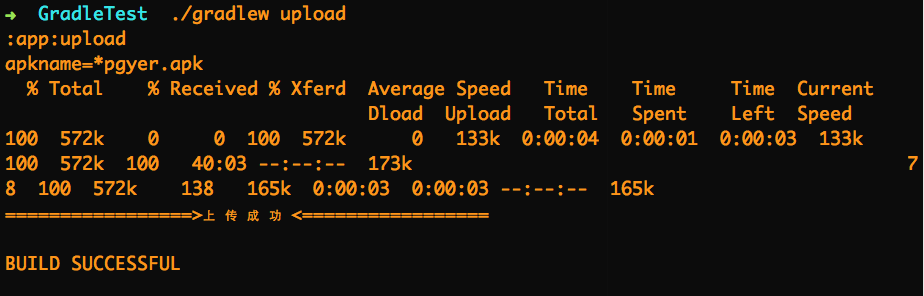

# GradleFile
这段时间整理Gradle的文件，集成了一些功能，可以一条命令分渠道打包，同时上传蒲公英平台，中间整理很多大牛的Gradle文件，将一些信息剥离出来，配置简单。


###怎么使用
共用四个文件build.gradle，constant.gradle，upload.sh，upload.log

- build.gradle 主要的gradle配置信息
- constant.gradle gradle中需要的私人信息，主要在这里填写，如Gradle的签名，渠道列表，包名等等
- upload.sh 上传至蒲公英平台的脚本信息
- upload.log 上传后的信息会保存到这里

将upload.sh，upload.log，constant.gradle复制到项目主目录下，build.gradle配置到APP文件夹下Gradle中，如果不是，修改相对目录信息即可（详细文件中有注释）

**需要提醒的是脚本中用到了[jq](http://stedolan.github.io/jq/download/)解析json，需要在终端配置好**

使用只需要在终端中运行

```
编译不同版本或者是想要渠道版本都可以
./gradlew assembleRelease 或者 ./gradlew assembleDebug
```

```
执行upload task上传apk至蒲公英
 ./gradlew upload
```


```
一条命令执行
./gradlew assembleRelease &&  ./gradlew upload
```


关于[蒲公英账号](http://www.pgyer.com/),申请后填入即可

###关于我
一名正在摸爬滚打的新手，项目有很多不足，没有大牛来的那么精炼，欢迎各种拍砖！！
